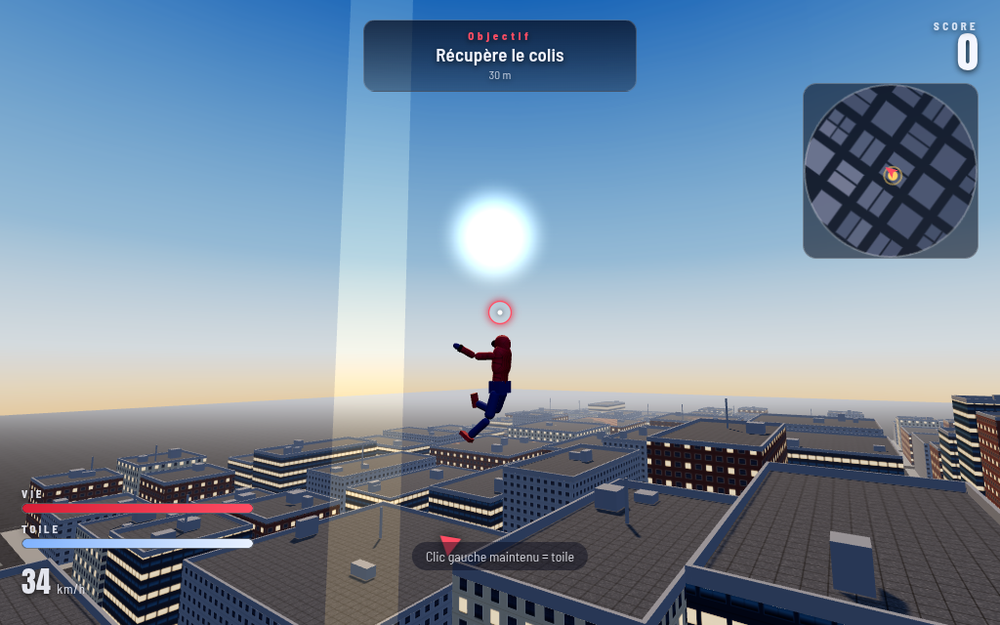
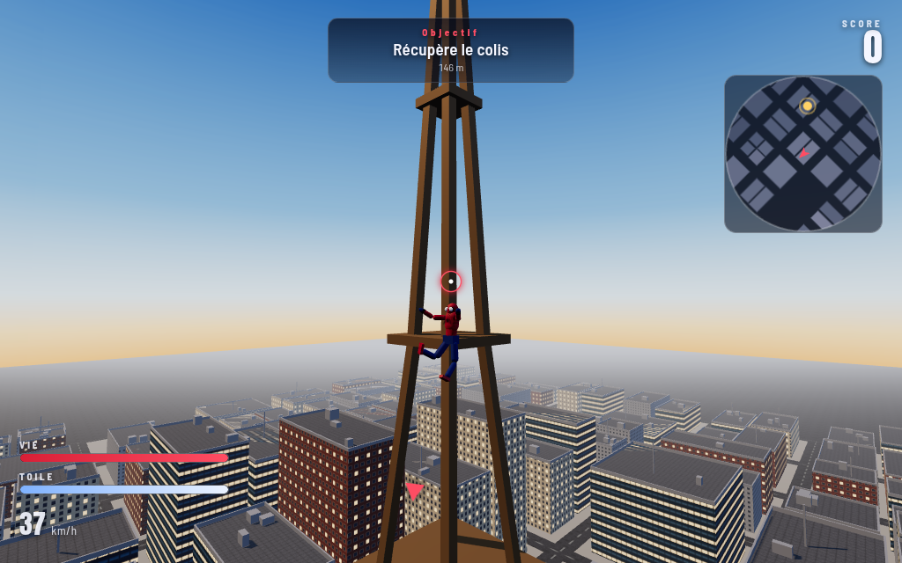
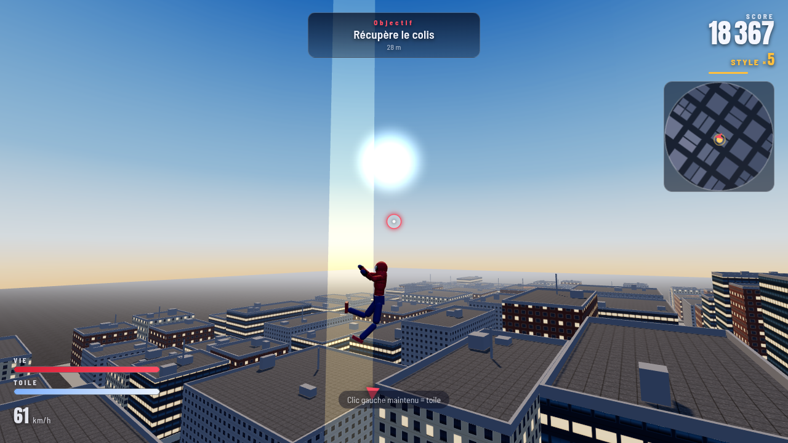

# 🕷️ Spider Neuille

Un jeu d'action **3D** dans lequel on se balance de toile en toile au-dessus de
**Neuille-sur-Toile**, une ville générée entièrement par le code.
Tout tient dans le navigateur : pas de moteur de jeu, pas d'images, pas de sons
à télécharger — textures, personnages et bruitages sont fabriqués à l'exécution.
Aucune requête réseau, y compris pour les polices.

> *Un grand pouvoir implique de grandes nouilles.*



## Jouer

**Le plus simple** : ouvrir `dist/spider-neuille.html` d'un double-clic.
Tout est dans ce fichier unique (three.js compris), il fonctionne hors ligne.

**Depuis les sources** (modules ES, il faut donc un petit serveur) :

```bash
npm start           # puis http://localhost:8080
```

## Commandes

| Touche | Action |
| --- | --- |
| `Z` `Q` `S` `D` | Se déplacer (relatif à la caméra) |
| Souris / trackpad | Orienter la caméra |
| Molette / 2 doigts | Zoom |
| **Clic gauche maintenu** | Tisser une toile et se balancer |
| Clic droit | Toile-éclair : se propulser vers le point visé |
| `Espace` | Sauter / lâcher la toile |
| `Maj` | Sprint au sol, piqué en l'air |
| `E` | Coup au corps à corps |
| `F` | Tir de toile (emballe un voyou) |
| `R` | Se replacer sur un toit |
| `M` / `P` | Son / Pause |

Au contact d'un mur, on s'y accroche automatiquement et on grimpe avec `Z`.

## Comment ça se joue

Maintiens le clic gauche : la toile part vers l'arête de toit la plus proche de
ta visée. Le fil se comporte comme un vrai pendule — tu prends de la vitesse en
descendant, et **la toile se détache toute seule au sommet de l'arc** pour que le
balancement s'enchaîne. Relâche au point bas pour être catapulté vers le haut.

Les missions s'enchaînent en continu : récupérer et livrer un colis, neutraliser
des voyous, secourir un civil. Rester vite et en l'air fait grimper le
multiplicateur **STYLE** (jusqu'à ×8).





## Comment c'est fait

| Fichier | Rôle |
| --- | --- |
| `src/main.js` | Boucle de jeu, score, enchaînement des actions |
| `src/world.js` | Ville procédurale : 224 immeubles fusionnés en 7 maillages, grille d'accélération, lancer de rayon maison |
| `src/player.js` | Physique du joueur : gravité, collisions, balancement, escalade, toile-éclair |
| `src/rig.js` | Le personnage, construit avec des primitives et animé par pose procédurale |
| `src/web.js` | Toiles : recherche d'ancrage avec aide à la visée, contrainte de corde, rendu des fils |
| `src/npc.js` | Voyous et civils |
| `src/missions.js` | Objectifs, balises, chrono |
| `src/camera.js` | Caméra 3e personne : suivi amorti, anti-mur, champ de vision lié à la vitesse |
| `src/textures.js` | Façades, toitures, bitume, ciel, costume : tout est dessiné dans des `<canvas>` |
| `src/audio.js` | Bruitages synthétisés (WebAudio), y compris le vent lié à la vitesse |
| `src/hud.js` | Interface, minimap, boussole d'objectif |
| `vendor/fonts.css` | Anton et Barlow Semi Condensed embarquées en base64 |

Quelques partis pris techniques :

- **Pas de `THREE.Raycaster`.** La ville n'est qu'un ensemble de boîtes alignées
  sur les axes ; un test rayon/boîte indexé dans une grille est bien plus rapide
  et donne directement la normale de la surface touchée.
- **Immeubles fusionnés.** Les 224 bâtiments sont assemblés en 7 géométries, avec
  des UV calculées en mètres : les fenêtres restent alignées d'un immeuble à
  l'autre quelle que soit leur taille.
- **Aide à la visée.** Si le tir direct ne touche rien d'exploitable, le jeu
  cherche la meilleure arête de toit dans un cône de 33° — et refuse les
  ancrages trop proches ou plus bas que le joueur, qui collent le joueur aux
  façades.
- **Disposition AZERTY.** Les touches sont lues via `event.key`, donc `Z Q S D`
  correspond aux lettres réellement tapées quel que soit le clavier
  (`W A S D` fonctionne aussi).
- **Repli sans capture du pointeur.** Si le navigateur refuse le *pointer lock*
  (page intégrée dans un cadre restreint), le jeu bascule en visée libre au bout
  d'une demi-seconde au lieu de rester bloqué.

## Développement

```bash
npm install
npm run build      # -> dist/spider-neuille.html (fichier unique, 696 Ko)
npm test           # test de fumée + simulation physique 60 Hz, headless
npm run shots      # captures d'écran de contrôle dans tools/
```

`tools/sim.mjs` pilote le jeu image par image sans rasterisation : il mesure la
vitesse atteinte en balancement, la distance parcourue, le temps passé dans
chaque état et le coût CPU d'une image (~0,3 ms).
